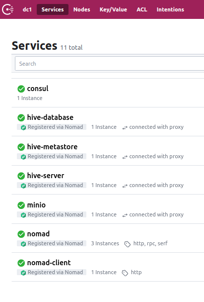

# docker-hive
Docker build for hive 3.1.0 based on [fredrikhgrelland/hadoop](https://github.com/fredrikhgrelland/docker-hadoop).

This image is built to work with object storage, only.
Hive metastore requires connection to a postgres database.

The image can take role as both metastore and hiveserver and is based on the apache hive release bundle.
NOTE: This image is ment to be used as a metastore and hiveserver DDL broker only. It has not been tested for carrying any load.
This might work but it is currently missing tez binaries and it will probably be dead-slow. You may use this image as a metastore for presto, 
and as a HQL-endpoint for NIFI.

## Note on versions
Compatiability of hadoop and hive is ensured by using A know working combination.
See Hortonworks ( or cloudera ) compatibility in releasenotes. https://docs.cloudera.com/HDPDocuments/HDP3/HDP-3.1.0/release-notes/content/comp_versions.html

## Published images
- [dockerhub](https://hub.docker.com/r/fredrikhgrelland/hive)
- [github](https://github.com/fredrikhgrelland/docker-hive/packages)

## Build locally for development
`make build`

This image can be built and operated behind a corporate proxy where the base os needs to trust a custom CA. [See this](./ca_certificates/README.md)

While building locally using the Makefile, you may set the environment variable CUSTOM_CA to a file or directory in order to import them.
`CUSTOM_CA=/usr/local/share/ca-certificates make`
## Run locally
Image could be run locally using vagrant box [fredrikhgrelland/hashistack](https://github.com/fredrikhgrelland/vagrant-hashistack). 

Prerequisite is to have [vagrant](https://www.vagrantup.com/) Prerequisite is to have [vagrant](https://www.vagrantup.com/) and [virtualbox](https://www.virtualbox.org/) 

```
// usual run
make up

// test
make test
```

Box runs [HashiCorp products](https://github.com/fredrikhgrelland/vagrant-hashistack#hashistack): Consul, Nomad, Vault, etc...

Hive with required dependencies(database, s3) will be deployed on [Nomad](https://www.nomadproject.io/) as a docker container.

Stack:
- [MinIO](https://min.io/)
- [Postgres](https://hub.docker.com/_/postgres)
- [Hive - metastore mode](https://github.com/fredrikhgrelland/docker-hive/blob/master/bin/hivemetastore)
- [Hive - server mode](https://github.com/fredrikhgrelland/docker-hive/blob/master/bin/hiveserver)

`NB`: Nomad jobs are configured to run with [consul-connect](https://www.consul.io/docs/connect) integration (service mesh). 



## Examples cli
hive metastore (connection)
```bash
beeline -u jdbc:hive2://
```
hive server (connection)
```bash
beeline -u "jdbc:hive2://localhost:10000/default;auth=noSasl" -n hive -p hive
```
beeline cli
```bash
SHOW DATABASES;
SHOW TABLES IN <database-name>;
SELECT * FROM <database-name>.<table-name>;
```

### Credits:
Influenced by [BDE](https://github.com/big-data-europe/docker-hive)
